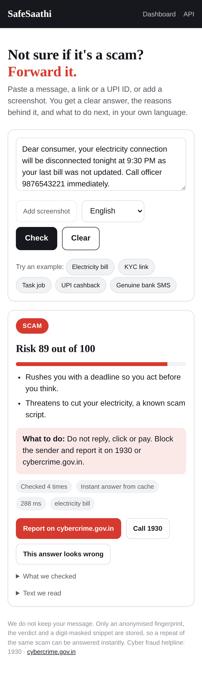

# SafeSaathi

**Not sure if it's a scam? Forward it.**

SafeSaathi checks a suspicious message, screenshot, link, UPI ID or voice note and answers in
seconds: **Safe, Suspicious or Scam**, with the reasons in plain words, in the user's own
language, plus what to do next. It runs as a Telegram bot and as a web app that share one API.

Built for Global Innovation Hackathon 2026, theme *Innovate Without Borders*.

| | |
| --- | --- |
| Web app | `https://safesaathi.onrender.com/` |
| Telegram bot | `<paste t.me/YourBotName>` |
| API docs | `<your URL>/docs` |
| Demo video | `<paste the YouTube link>` |
| Team | `TechTonic` - `Anuj Raikwar`, `Om Priyanshu`, `Anwesh Narayan Mund`, `Aakriti Pathak`, `Sukriti Kamani`, `Anwesha Kundu` |



## What works today

- **Any format, one place.** Text, screenshot, link, UPI ID, phone number, voice note.
- **A verdict with reasons.** Every answer lists up to three reasons drawn from the message
  itself, never a bare "spam" label.
- **Local languages.** English, Hindi, Tamil, Bengali, Marathi and Telugu, as text and as a
  voice note.
- **Link checks.** Lookalike domains, domain age through RDAP, shortened links, risky
  top-level domains and Google Safe Browsing.
- **UPI and number checks.** Handle sanity, community reports, and an honest note that nobody
  can see who owns a UPI ID.
- **Family Guardian.** A parent links one family member, who is alerted the moment a likely
  scam reaches the parent.
- **Scam radar.** Identical scam templates are recognised, counted and answered from cache in
  milliseconds. The dashboard shows what is trending.
- **It degrades well.** With no API keys at all it still answers from the rules, the link
  checks and the classifier, so a demo never dies because of a quota.

## Quick start (about two minutes)

```bash
git clone <your repo url> && cd safesaathi
cp .env.example .env                 # optional: add your keys

python -m venv .venv && source .venv/bin/activate      # Windows: .venv\Scripts\activate
pip install -r backend/requirements.txt

python ml/generate_seed.py && python ml/train.py       # builds the classifier
cd backend && uvicorn app.main:app --reload            # http://localhost:8000
```

Open `http://localhost:8000` for the web app, `/dashboard` for the scam radar and `/docs` for
the API. To run the Telegram bot on a laptop, put a bot token in `.env` and run
`cd backend && python -m app.bot.poll`. To deploy, see [DEPLOY.md](DEPLOY.md).

## How a check works

```
Telegram bot ─┐
              ├─→ POST /api/analyze ─→ 1 read ─→ 2 cache ─→ 3 fast checks ─→ 4 Gemini ─→ 5 combine ─→ reply
Web app ──────┘                          │          │            │              │           │
                                    OCR / Gemini  fingerprint  rules, links,  evidence    risk score
                                    for images    lookup       UPI, model     in prompt   and verdict
```

1. **Read.** Text goes straight through. A screenshot or voice note is transcribed by Gemini,
   or by Tesseract OCR when no API key is set.
2. **Cache.** The text is normalised (numbers, links and IDs replaced) and hashed into a
   template fingerprint. A template we have seen before is answered from the database in
   milliseconds, and its counter goes up.
3. **Fast checks** run in parallel with short timeouts: 15 red-flag rules in English, Hinglish
   and Hindi; link reputation; UPI and phone checks; the classifier score.
4. **Gemini** gets the message (with phone numbers, account numbers and emails masked) plus
   those findings as evidence, and returns strict JSON: verdict, risk, category, up to three
   reasons, advice.
5. **Combine.** `risk = 0.6 x Gemini + 25 x classifier + 10 x flags`, with overrides: a Safe
   Browsing hit is at least 95, a lookalike domain at least 75, a hard rule at least 80.
   70+ is Scam, 40 to 69 Suspicious, below 40 Safe.

Full detail: [docs/architecture.md](docs/architecture.md) and [docs/api.md](docs/api.md).

## Results

Measured on 112 held-out messages whose wording never appears in training or in the prompt,
with **no Gemini key** (rules plus classifier only), so this is the floor rather than the
ceiling:

| Measure | Result |
| --- | --- |
| Scam messages caught | 100% |
| Genuine messages wrongly flagged | 0% |
| Median time per check | 0.01 s |

The seed corpus is written by the team from public advisories and our own inboxes, so real
inboxes will be harder. [docs/evaluation.md](docs/evaluation.md) says exactly what the number
does and does not prove, and `ml/evaluate.py` reruns it against any deployment.

## Tech stack

| Layer | What we used |
| --- | --- |
| Backend | Python 3.12, FastAPI, Uvicorn, SQLAlchemy |
| AI | Gemini Flash through `google-genai`, strict JSON schema, prompt-injection guard |
| Classifier | scikit-learn TF-IDF (word + character n-grams) and logistic regression |
| Link checks | RDAP domain age, Google Safe Browsing, lookalike matching, shortener expansion |
| Screenshots | Gemini vision, with Tesseract OCR as the offline fallback |
| Voice | gTTS for replies; Gemini for listening to voice notes |
| Storage | SQLite by default, Postgres or Supabase through `DATABASE_URL` |
| Bot | Telegram Bot API over a webhook, with a polling runner for laptops |
| Web | Plain HTML, CSS and JavaScript, no build step, served by the same service |
| Hosting | One Docker image on Render (free tier), blueprint in `render.yaml` |

## Privacy

We do not keep the message. What is stored is a one-way fingerprint of the normalised text,
the verdict, and a snippet with every digit masked, which is what makes repeat detection
possible. Telegram chat IDs are hashed before they are logged. Phone numbers, account numbers
and email addresses are masked before anything is sent to Gemini, because free-tier prompts
may be used to improve Google's products. Details in [docs/privacy.md](docs/privacy.md).

## Limits we are honest about

- We cannot see who owns a UPI ID or a phone number. We check patterns and community reports.
- Voice notes need Gemini. Without a key, we ask for text or a screenshot instead.
- The seed dataset is template-generated; real collected messages are what will make the
  classifier good ([docs/data-and-model.md](docs/data-and-model.md)).
- Free hosting sleeps after 15 minutes of no traffic, so the first request can take a minute.

More in [docs/limitations.md](docs/limitations.md).

## What comes next

WhatsApp through the Business API, Bhashini for more Indian languages, a fine-tuned MuRIL
classifier, checks on recorded calls, and an API so banks and UPI apps can check a request
before money moves.

## Acknowledgements

- Public datasets for future training: [UCI SMS Spam Collection](https://archive.ics.uci.edu/dataset/228/sms+spam+collection)
  (CC BY 4.0) and the [SMS Phishing Dataset by Mishra and Soni](https://data.mendeley.com/datasets/f45bkkt8pr/1).
- Scam patterns from public advisories, news reports and messages on our own phones.
- Google Gemini API, Google Safe Browsing, RDAP, gTTS, Tesseract, FastAPI, scikit-learn.
- AI coding assistants were used while building this project. Every file was reviewed and
  tested by the team, and we are responsible for all of it.

## Licence

MIT. See [LICENSE](LICENSE).
